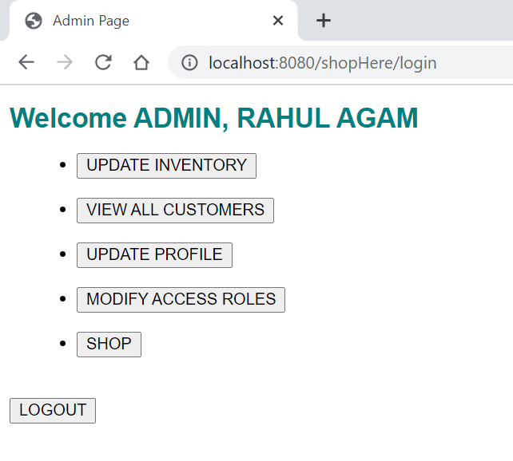
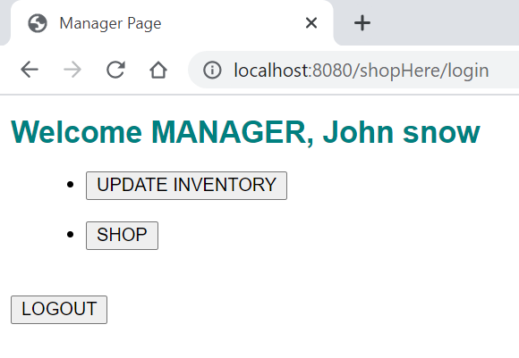
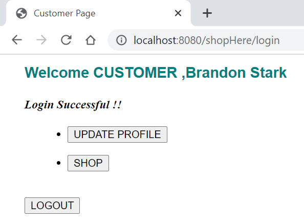
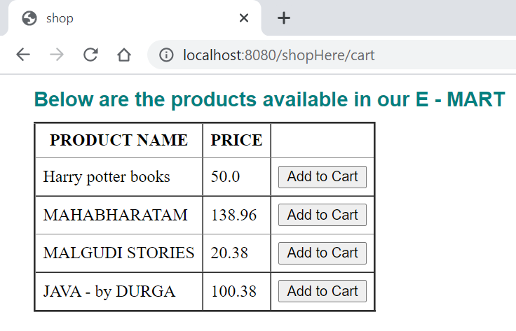
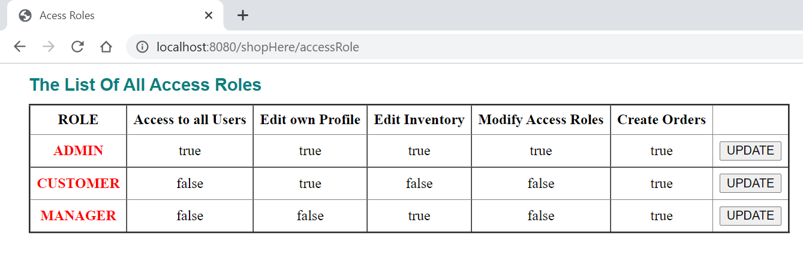
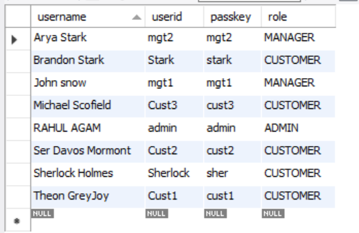
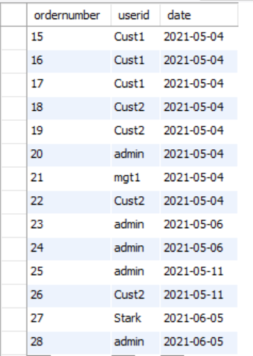
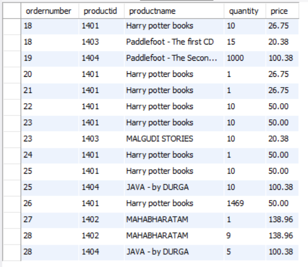

# ShopHere - E-commerce Portal

  ShopHere is a Web Application similar to an E-commerce portal. It has three different users ADMIN, MANAGER, CUSTOMER. 
  The project uses MySQL database to store products, user and orders related information. Session management, Login & Logout, Errors are also handled in this project.

<h2> Users and their Roles </h2>
<ol>
<li> <b>ADMIN</b>     -   Can add new products, update the inventory, view all customers, modify customer's & his profile, shop and modify roles. </li>
<li> <b>MANAGER</b>   -   Can update inventory, modify his own profile. </li>
<li> <b>CUSTOMER</b>  -   Can place orders (shopping) and update his profile. </li>
</ol>

<h2> Tech Stack </h2>
<ul>
<li> <b>Servlets</b> - To handle client requests</li>
<li> <b>HTML, CSS, JSP</b> - As Front End </li>
<li> <b>JDBC</b> - To communicate with Database</li>
<li> <b>MySQL</b> - Database </li>
</ul>

<h2> PROJECT OUTPUT </h2>

<h5> ADMIN VIEW </h5>

<h5> MANAGER VIEW </h5>

<h5> CUSTOMER VIEW </h5>

<h5> ALL PRODUCTS </h5>

<h5> ROLES </h5>

<h5> USERS TABLE IN DATABASE </h5>

<h5> ORDERS TABLE IN DATABASE </h5>

<h5> ORDERITEMS TABLE IN DB </h5>

